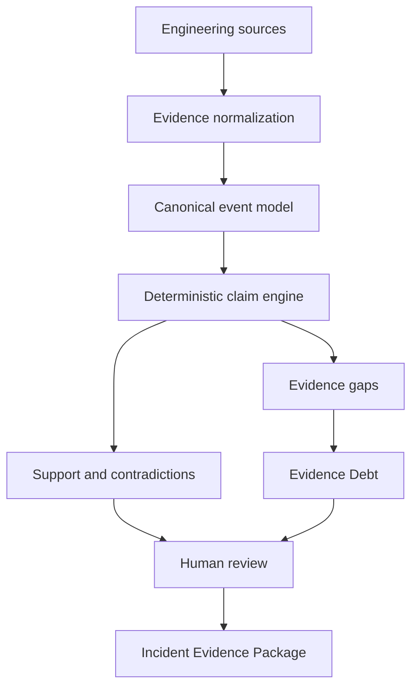

# Faultline

**A deterministic causal-evidence system for investigating production failures.**

[Live product](https://faultline-evidence.ntandovuyanmiya.chatgpt.site) · [Connected evidence source](https://github.com/Sekani-27/Nexara)

Production incidents generate plenty of data—logs, metrics, deployments, traces and alerts—but data alone does not establish why a system failed.

Faultline turns those scattered records into an inspectable argument. It tests competing explanations against shared evidence, exposes contradictions and missing observations, and produces a reviewable evidence package without allowing an AI model to decide the cause.

> Faultline does for production failure claims what a test suite does for software behaviour: it makes the reasoning explicit, repeatable and challengeable.

## The problem

Post-incident analysis often collapses into a confident narrative: a deployment happened before an outage, rollback appeared to restore service, and therefore the deployment caused the outage. That conclusion may be correct, but sequence is not causality.

Teams need to distinguish what was directly observed, what was inferred, which evidence contradicts a claim, what the system could not observe, and who accepted the final conclusion. Faultline makes those distinctions visible.

## What the product does

For every incident, Faultline:

1. Normalizes observations from engineering systems into a canonical evidence model.
2. Evaluates competing causal claims using transparent rules.
3. Records supporting evidence, contradictions and required-but-missing signals.
4. Calculates a bounded claim status and confidence level.
5. Converts missing observability into **Evidence Debt**.
6. Preserves a human review decision and investigation state.
7. Generates an Incident Evidence Package.

The prototype includes three incident patterns:

| Scenario | Leading explanation |
| --- | --- |
| Checkout failures after release v2.8.1 | Production change |
| Flash-sale capacity exhaustion | Traffic surge |
| Regional payment gateway degradation | Shared dependency |

All three scenarios pass through the same rule engine. The result changes because the evidence changes—not because the interface contains a predetermined verdict.

## Deterministic by design

Faultline does not use an LLM to decide what caused an incident.

Each claim defines required signals, predicted observations, fixed support and contradiction weights, a score boundary and a confidence boundary.

```ts
{
  signal: "rollback_recovery",
  expected: true,
  weight: 3,
  rationale: "Reversal preceded recovery"
}
```

Evidence matching the prediction adds its fixed weight. Contradicting evidence subtracts it. Missing required signals create Evidence Debt. Every outcome can therefore be traced back to a rule and a source record.

## Evidence Debt

Technical debt describes compromises in implementation. **Evidence Debt** describes important questions a system cannot currently answer.

For example: *Did release v2.8.1 directly leak database connections?*

If connection lifecycle metrics are not tagged by build SHA, Faultline cannot honestly mark that relationship as directly observed. It records an Evidence Debt item describing the missing signal and the instrumentation required to make the claim testable next time.

This converts uncertainty into concrete observability work.

## GitHub evidence connection

Faultline is connected to [Sekani-27/Nexara](https://github.com/Sekani-27/Nexara) as its first repository evidence source.

The Sources workspace imports and normalizes:

- Commits and commit SHAs
- GitHub Actions workflow outcomes
- Deployment events
- Pull-request review provenance
- Timestamps and direct source links

Imported GitHub activity remains an observation. It affects a causal claim only when its time, service and release identity correlate with the incident under investigation.

## Architecture



| Component | Responsibility |
| --- | --- |
| Canonical event model | Gives evidence from different systems one consistent shape |
| Claim engine | Evaluates fixed rules and weights deterministically |
| Rule trace | Shows why each rule passed, contradicted or lacked evidence |
| Evidence Debt engine | Generates instrumentation work from missing required signals |
| Sources workspace | Preserves repository provenance and source links |
| Review workflow | Keeps a human accountable for adopting the assessment |
| D1 persistence | Stores investigation selection, debt state and review decision |

## Technology

- TypeScript
- React 19 and Next.js 16
- Vinext and Vite
- Cloudflare Workers and D1
- Drizzle ORM
- Node test runner
- GitHub REST API

## Running locally

### Requirements

- Node.js 22.13 or newer
- npm

### Setup

```bash
npm install
npm run dev
```

### Validation

```bash
npm test
```

The tests verify that the same deterministic rules identify a bad deployment, a traffic surge, a shared dependency failure, and missing signals that must become Evidence Debt.

## Repository structure

```text
app/                  Product interface
lib/                  Deterministic evidence engine
worker/               API, GitHub ingestion and persistence
db/                   Investigation-state schema
drizzle/              Database migration
tests/                 Engine behaviour tests
public/                Static product assets
```

## Portfolio significance

Faultline demonstrates more than dashboard design. It combines causal reasoning expressed as software rules, production-incident and observability concepts, evidence provenance, deterministic decision logic, durable workflow state, external engineering-system integration, human accountability and product-level UX.

It is intentionally positioned beside Veriform: Veriform asks whether an engineering decision can be defended **before** implementation; Faultline asks whether an explanation of failure can be defended **after** production impact.

## Current scope

This repository is a functional portfolio prototype. GitHub is the first evidence source, and three curated scenarios exercise the claim engine. Production expansion would add connectors for Prometheus, Kubernetes, OpenTelemetry, Argo CD and incident-management platforms, plus identity-aware multi-user investigations.

## Author

Created by **Ntando Miya** — Johannesburg, South Africa.

Built as part of a portfolio focused on DevOps, platform engineering, observability and deterministic AI-adjacent systems.
